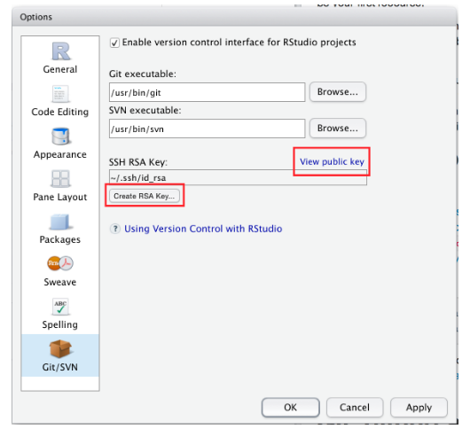
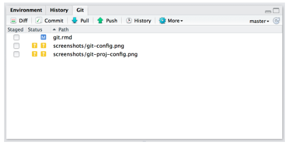
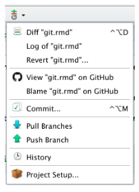
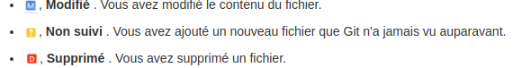
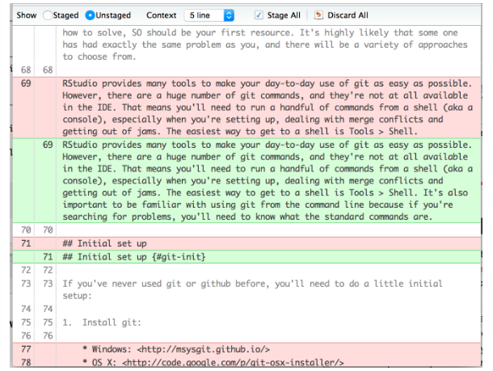
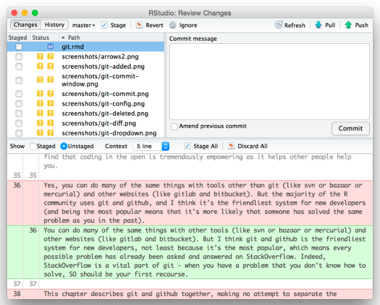
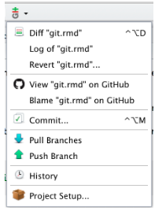

# Références

[Wickam Git et Github](http://r-pkgs.had.co.nz/git.html)

[Progit](https://git-scm.com/book/fr/v2)

[Github Documentation](https://help.github.com/en/github)

# Installation du package

Pour tout utilisateur de R peut installer le package
```
install.packages("devtools)
devtools::instal_github("username/packagename")
```

# R studio - Git et Git hub

R Studio fournit les commandes les plus utilisées. Il faut aussi utiliser le shell ` Outils >Shell` qui permet l'ouverture d'un nouveau shell ouvert dans le répertoire racine du projet.

Parmi les commandes les plus importantes

* `pwd` déterminer le répertoire actuel de travail
* `cd repertoire`  se déplacer dans un répertoire
* `ls` Liste des fichiers du répertoire actuel

Voir [Brennen Userlandèbook](https://p1k3.com/userland-book/) - [Debian facile](Gestion des fichiers sous linux)

# Installer git

* Windows https://git-scm.com/download/win
* linux `sudo apt-get install git-core`

# Configuration de base 

Donner à git son nom et son adresse email qui sont utilisés à chaque validation
```
git config --global user.name "mon nom"
git config --global user.email "mon mail"
git config --global --list

```

# Créer un compte github

site https://github.com/ . Créer compte qui doit avoir la même adresse mail.

# Générer une clé SSH

Cela permet de communiquer sans mot de passe. La clé possède une partie publique et privée. Les personnes qui disposent de la clé publique peuvent crypter en toute sécurité les données

Pour vérifier s'il on dispose d'un clé SSH dans R 
```
file.exists(~/".ssh/id_rsa.pub")
```
si FALSE il faut créer une nouvelle clé en accédant aux `options globales de RStudio > Panneau GIT/SVN > Cliquer sur 'clé RSA'`



On peut donner à git la clé ssh : https://github.com/settings/keys

# Créer un référentiel local (repo) 

1. Cela crée un .git reoertoire qui stocke les fichiers de configuration et une base de données qui enregistre les modifications apportées au code. 

* Dans Rstudio `Project Options > Git/SVN > Version control system 'Git' > Redemarrer R studio`
* Dans un shel `git init`

2.Deux nouveaux composants du repo

* Panneau de configuration
	


* Menu déroulant 
	


* Utilité

3. Il est alors possible de voir ce qui a changé en répertoriant tous les fichiers ajoutés, modifiés ou supprimés
	


4. Plusieurs manières d'afficher les détails 
	
		* `Diff`
		* `git status` Aperçu des modifications
		* `git status` Détail des modifications
		


5. Signification des couleurs
	
		* Vert : texte ajouté
		* Rouge : texte supprimé 

# Enregistrer les changements

Les commit sont l'unité de travail fondamental. C'est une validation instantanné du code à un moment spécifié. Ils sont comme des ancres qui permettent de baliser les différentes étapes.

Un commit a 5 composants 

* Un identifiant unique SHA 
* Un ensemble de modifications qui décrit les fichiers ajoutés, modifiés et supprimés
* Un message de validation
* Un parent (le commit précédent)
* Un auteur

Mise en oeuvre 

* Indiquer les modifications à prendre en compte
* Décrire les modifications
* Valider

Dans R studio

* `Commit`
* `Ctrl+Alt+m`
* sélectionner les fichiers



La fenêtre de validation a 3 volets

* volet supérieur gauche : état actuel
* volet inférieur : différence du fichier actuellement sélectionné
* volet supérieur droit : message de validation

# Ignorer les fichiers

Clic droit sur le fichier dans le volet git et sélectionner `Ignore`

# Annuler une erreur

1. Clic droit dans le volet git et `Revenir` ce qui permettra d'annuler toutes les modifications apportées à la validation précédente. Par contre on ne peut pas annuler l'annulation.

2. Si on ne remarque pas l'erreur tout de suite 
* revenir dans l'historique `history`
* Retrouver le commit où l'erreur s'est produite et noter le SHA parent
* Dans le shell `git show <SHA><nomfichier>` ou copier la version passé dans le présent `git checkout <SHA> <nomfichier>`
	*	[Git fixup](http://sethrobertson.github.io/GitFixUm/fixup.html)
	* [Hileman Git pretty](http://justinhileman.info/article/git-pretty/)
	
# Synchronisation avec gihub

## Pour transmettre le code `push`

### Faire le transfert

1. On crée un nouveau référentiel sur Github avec le même nom que pour le dossier local : https://github.com/new

2. Dans le schell
```
git remote add origin git@github.com:nom/projet
git push -u origin master
```

### Pour vérifier la mise à jour

On peut modifier la description et faire `Push`. La traduction de push pourrait être publier. Il faut cependant publier du code vérifiè. Le volet git indique le nombre de commits fait localement  qui ne sont pas sur github.

# Avantages d'utiliser Github

1. La page web répertorie tous les fichiers du dépôt. Pour le rendu des fichiers
* .R coloration syntaxique
* .Rmd fichiers rendus en HTML
* .READ.md sera affichier dans le niveau supérieur

2. Tout usager de R peut télécharger le package
` devtools::install_github("username/package")
3. Suivi de l'historique du projet ex : https://github.com/r-lib/testthat/commits/master. Ce sont les mêmes informations que dans la fenêtre `commit/diff` de RStudio.
4. Historique de fichier. 
	* Si on clique sur un fichier et `History`
	* `Blame` Montre la dernière modification apportée à chaque ligne de code, qui a effectué la modification et le commit.
	* Accès à la page d'historique RStudio
	


5. Possibilité de commenter les commits : en passant sur la ligne avec clic sur `+`

# Charger la dernière version 

On ne peut faire un push que si on a extrait la dernière version de github avec `git pull` ce qui permet de vérifier la dernières versions et de la fusionner avec les modifications apportées.

Il y a un conflit de fusion quand l'extraction échoue. 

Pour annuler une fusion 
```
git_merge --abort
git pull
```
# Suivi des problèmes

Pour chaque dépôt. A documenter. Voir [guide GitHub sur les problèmes](https://guides.github.com/features/issues/)

# Branches

## Branche principale

La branche par défaut est appelée `master`. Si on synchronise avec github cette branche est appelée `origin/master`

Quand on fait `git pull` on fait en fait

* `git fetch origin master` pour mettre à jour la branche origin/master avec les dernières validations de github
* `git merge origin/master` pour combiner les modifications à distance avec ses modifications 

## Branches secondaires

Cela permet de se séparer temporairement du flux principal de développement . 

* Syntaxe `git checkout -b <branche-nom>`
* Pour basculer à la branche secondaire `git checkout <branche-name>`
* Pour revenir à la branche principale `git checkout master`
* Il existe aussi un sélecteur de branche dans le volet git
* Pour avoir la liste de toutes les branches `git branch`
* Pour relier les branches secondaires à github `git push --set-upstream origin <branch-name>`
* Pour intégrer les modifications à la branche maitre et supprimer la branche secondaire
```
git checkout master
git merge <branch-name>
git branche -d <branch-name>
```
# Extractions

Voir [Github - Pull Request](https://help.github.com/en/github/collaborating-with-issues-and-pull-requests/about-pull-requests)

* Le clonage permet de créer une copie locale du dépôt distant
```
git clone git@github.com:<mon-nom>/<repo>.git
cd <repo>
```
* Pour synchroniser la copie clonée qui est statique avec le dépôt en amont
```
git remote add upstream git@github.com:<original-name>/<repo>
```
* Pour fusionner les modifications avec le dépôt local
```
git merge upstream/master
```
* Pour créer des branches locales
```
git branch -u upstream/master
```
* Pour mettre à jour le référentiel local
```
git checkout master
git pull
```
* Pour fusionner les modifications éventuelles
```
git checkout <my-branch>
git merge master
``` 

